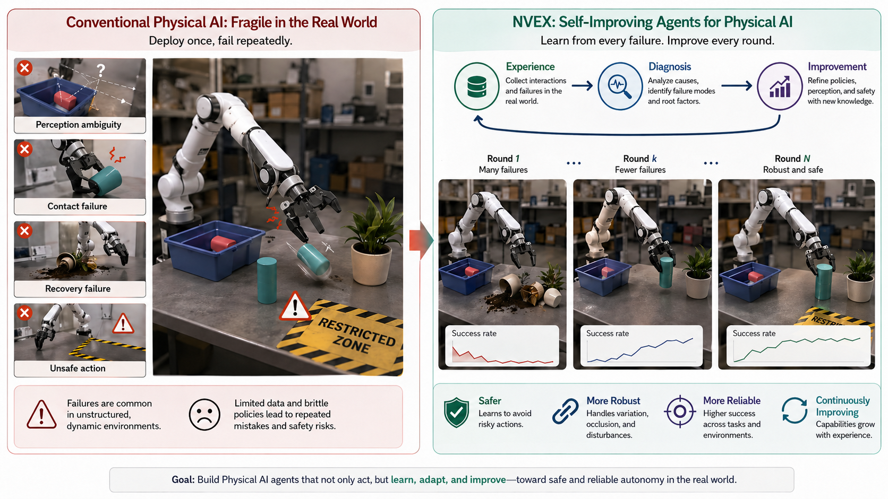

<div align="center">

### NVex: Self-Improving Physical AI Orchestration

[](LICENSE)
[](#run-the-demo)
[](#current-status)

<p align="center">
  
</p>

**Nvex turns policy failure into a repeatable improvement loop.**

When a Physical AI policy fails, Nvex imports the evaluation artifact, maps failure modes, diagnoses capability gaps, generates a targeted patch plan, dispatches the improvement run, verifies the new checkpoint, and saves the resulting recipe to platform memory.

[What Nvex Does](#what-nvex-does) · [The Loop](#the-loop) · [Demo](#run-the-demo) · [API](#api-surface) · [Roadmap](#roadmap) · [Acknowledgment](#acknowledgment)

</div>

---

## What Nvex Does

Robotics and Physical AI teams often know that a checkpoint is failing before they know what to do about it. A policy may plateau at 60-70% success, but the next step is usually scattered across video review, benchmark logs, intuition, ad hoc data collection, and disconnected training runs.

Nvex is the orchestration layer for that gap.

It takes the messy middle between "the robot failed" and "the next checkpoint is better" and turns it into structured work:

```text
eval artifact -> failure map -> root-cause diagnosis -> patch plan
              -> improvement run -> re-eval -> platform memory
```

Nvex does not present failure as a static dashboard. It decides what should happen next: which failures matter, what data to target, which training strategy to run, what success criteria to verify, and what reusable knowledge should be saved for future loops.

## Who It Is For

**Robotics and Physical AI teams** use Nvex when they already have a policy and need faster, more disciplined improvement cycles:

- Diagnose why a checkpoint fails instead of only seeing aggregate success rate.
- Convert benchmark results into a concrete data and training plan.
- Track the improvement run from patch plan to verified checkpoint.
- Save each fix as reusable platform memory.

**Technical and business evaluators** use Nvex to understand whether a Physical AI system can compound:

- Does every failed run create reusable knowledge?
- Can the system explain why a patch should work?
- Can improvement be measured and repeated?
- Is the platform more than a training script, annotation queue, or MLOps dashboard?

## The Loop

Nvex follows the PEARL loop shown above: experience, diagnosis, improvement, and reuse.

| Stage | Nvex output |
| --- | --- |
| **Project Intake** | Checkpoint summary, benchmark context, starting KPI, risk flags |
| **Failure Map** | Failure clusters, affected tasks, suspected root causes, priority ranking |
| **Patch Plan** | Target data spec, training strategy, verification protocol, expected uplift |
| **Iteration Runner** | Job dispatch, stage tracking, logs, produced artifacts |
| **Improvement Report** | Before/after KPI comparison, pass/fail verification, next action |
| **Platform Memory** | Reusable recipes, failure ontology entries, pipeline templates |

The demo scenario uses a LIBERO Kitchen pick-and-place checkpoint:

```text
NeuroVLA-LIBERO-ckpt_v0.7: 62% success
Nvex diagnosis: occlusion-heavy scenes and missing recovery trajectories
Nvex patch: targeted episodes + teleop corrections + continual-learning update
Verified result: ckpt_v0.8 at 74% success
Saved memory: reusable occlusion/recovery patch recipe
```

## Product Surface

The current Nvex demo is a 7-page interactive workflow:

| Page | Purpose |
| --- | --- |
| **Project Hub** | Select a Physical AI project and see loop-level platform metrics |
| **Project Overview** | Understand current checkpoint status, task breakdown, and next action |
| **Failure Map** | Inspect failure clusters and root-cause hypotheses |
| **Patch Plan** | Review the data, training, and verification plan Nvex generated |
| **Iteration Runner** | Watch the improvement run move through execution stages |
| **Improvement Report** | Compare before/after results and verify uplift |
| **Platform Memory** | See the recipes and patterns created by prior loops |

## Current Status

**Nvex Milestone 3 is fully implemented.** The platform runs the complete failure-to-improvement loop autonomously.

### Milestone 2 ✅ — Executable MVP
- `nvex_server/` provides the FastAPI backend for demo state, artifact import, patch-plan generation, job dispatch, status polling, and improvement reports.
- `demo/` provides the React + Vite interactive 7-page product demo.
- `nvex_server/examples/` contains seeded before/after LIBERO Kitchen eval artifacts for the 62% → 74% improvement case.
- The backend can ingest structured eval artifacts and produce Nvex-native schemas for failure maps, patch plans, iteration jobs, reports, and reusable memory assets.

### Milestone 3 ✅ — Self-Improving Agent
- `SelfImprovementAgent` orchestrates the full autonomous loop: eval → diagnose → plan → dispatch → verify → memory.
- Two modes: **simulate=True** (demo with precomputed 4-loop replay) and **simulate=False** (real AlphaBrain dispatch).
- Multi-iteration support with regression detection and rollback semantics (e.g., 62% → 74% → 81% → 79% rollback → 85%).
- `LLMNarrator` generates natural-language explanations for each step (powered by OpenAI gpt-4o-mini when available).
- React demo includes "Auto-Improve" button, live agent reasoning panel, and multi-iteration convergence chart.

### Milestone 4 — Customer-Grade Platform (In Progress)
- Streaming agent timeline with variable step durations
- Multi-project isolation and persistent platform memory
- Customer onboarding API (BYO checkpoint + eval artifact)
- Role-based views (operator vs executive)

## Run The Demo

### Quick Start

Start the backend:

```bash
./.venv/bin/python -m uvicorn nvex_server.app:app --reload --port 8000
```

Start the React app in another terminal:

```bash
cd demo
npm install
npm run dev
```

Open the Vite URL, usually:

```text
http://127.0.0.1:5173
```

The Vite dev server proxies `/api` requests to `http://127.0.0.1:8000`, so the React app consumes the local Nvex backend directly.

### Standalone Demo

For a static walkthrough without running a backend:

```bash
open demo/nvex-demo.html
```

### Demo Features

- **Seeded Improvement Scenario**: LIBERO Kitchen checkpoint 62% → 74% (then 81% → 85% with recovery after regression)
- **Auto-Improve Mode**: Click "Auto-Improve" to watch the agent run the full loop autonomously in demo mode
- **Live Agent Reasoning**: See the agent's decisions at each step (why CL over SFT, why targeting occlusion data)
- **Multi-Iteration Chart**: Visualize progression across loops, including rollback and recovery

## Key Capabilities

## Key Capabilities

✅ **Autonomous Improvement Loop** — Run the full failure→diagnosis→plan→train→verify cycle without manual steps  
✅ **Intelligent Patch Planning** — Map failure clusters to targeted training strategies (CL, SFT, VLM co-training)  
✅ **Real AlphaBrain Integration** — Dispatch jobs to continual learning, fine-tuning, or RL training backends  
✅ **LLM-Generated Reasoning** — Natural-language explanations for diagnosis, planning, and verification steps  
✅ **Multi-Iteration Convergence** — Track non-monotonic improvement arcs with regression detection and rollback  
✅ **Platform Memory** — Save recipes and patterns from each loop for reuse across projects  
✅ **Interactive Dashboard** — 7-page investor-focused narrative with live agent streaming and reasoning panels  

## API Surface

The local backend exposes:

| Endpoint | Purpose |
| --- | --- |
| `GET /health` | Health check |
| `GET /api/demo/state` | Seeded full demo state |
| `GET /api/demo/agent` | Pre-seeded autonomous agent run state |
| `POST /api/eval/import` | Import a benchmark artifact as an eval run |
| `POST /api/plan/generate` | Generate a patch plan from failures |
| `POST /api/iteration/start` | Start an improvement iteration |
| `GET /api/iteration/{id}/status` | Poll iteration status |
| `GET /api/report/{iteration_id}` | Fetch the improvement report |
| `POST /api/agent/run` | Launch a new autonomous improvement run |
| `GET /api/agent/{id}/status` | Poll autonomous agent state |
| `POST /api/agent/{id}/advance` | Advance agent by one step (for demo mode) |

## Repository Map

```text
nvex_server/
  app.py                    FastAPI routes and InMemoryStore
  agent.py                  SelfImprovementAgent orchestrator (demo + real modes)
  schemas.py                Nvex data contracts
  patch_plan_generator.py   Rule-based patch planner
  dispatcher.py             Iteration dispatch and status tracking
  exporters.py              Benchmark artifact import helpers
  llm_narrator.py           LLM-powered reasoning narration (OpenAI fallback)
  examples/                 Seeded before/after eval artifacts

demo/
  src/                      React product demo with 7 pages
  nvex-demo.html            Standalone static walkthrough

SELF_IMPROVEMENT_AGENT.md   Autonomous-loop design and semantics
IMPLEMENTATION_PLAN.md      Detailed milestones, delivery, and roadmap
assets/                     README and demo imagery
```

## Roadmap

| Milestone | Status | Focus |
| --- | --- | --- |
| **M2: Executable MVP** | ✅ Complete | Real backend path, seeded LIBERO improvement case, interactive demo |
| **M3: Self-Improving Agent** | ✅ Complete | Autonomous loop runner, LLM narration, stopping criteria, reasoning UI |
| **M4: Customer-Grade Platform** | 🔄 In Progress | Streaming timeline, multi-project support, persistent memory, customer onboarding API |

See [`IMPLEMENTATION_PLAN.md`](IMPLEMENTATION_PLAN.md) and [`SELF_IMPROVEMENT_AGENT.md`](SELF_IMPROVEMENT_AGENT.md) for the full plan.

## Citation

```bibtex
@software{Nvex2026,
  title   = {Nvex: Self-Improving Physical AI Orchestration},
  author  = {Nvex Contributors},
  year    = {2026},
  license = {MIT}
}
```

## License

[MIT License](LICENSE)

## Acknowledgment

Nvex is the orchestration and intelligence layer. This repository currently includes **AlphaBrain** as the bundled execution layer for VLA training, evaluation, continual learning, world-model experiments, RL fine-tuning, and benchmark integration.

AlphaBrain is a modular PyTorch framework for embodied intelligence research and is forked from [starVLA](https://github.com/starVLA/starVLA). The AlphaBrain code builds on work from the broader open-source robotics and VLA ecosystem, including OpenVLA, openvla-oft, openpi, Isaac-GR00T, Qwen-VL, Cosmos, Wan, LIBERO, RoboCasa, and NeuroVLA.

<div align="center">
<sub>Nvex learns from every failure and makes every improvement reusable.</sub>
</div>
